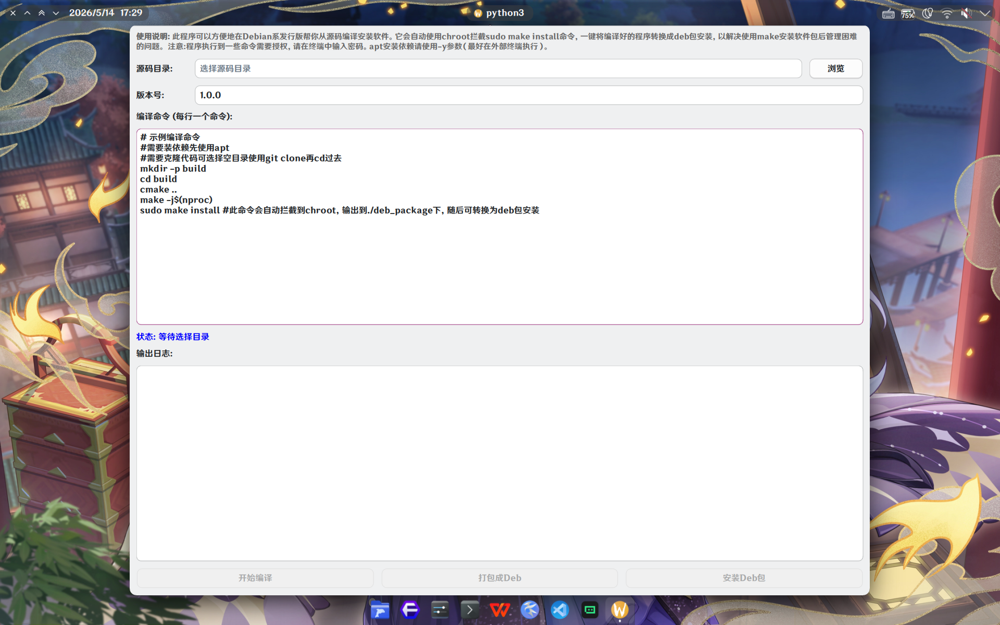
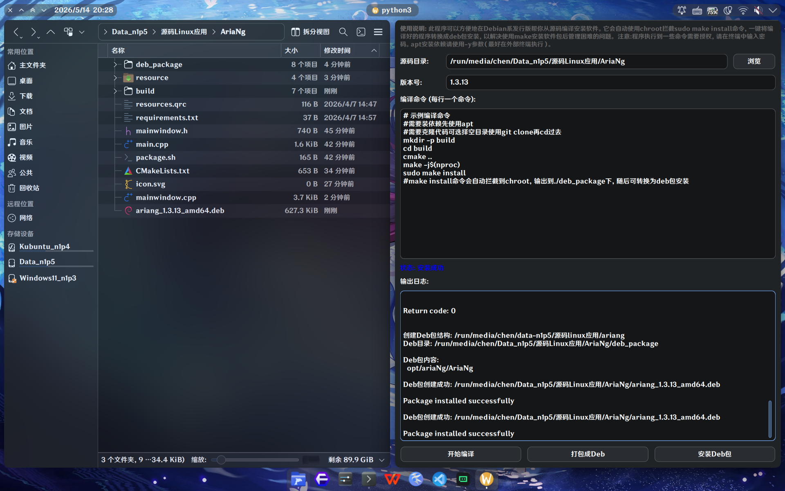

此程序可以方便地在Debian系发行版帮你从源码编译安装软件。它会自动使用chroot拦截sudo make install命令，一键将编译好的程序转换成deb包安装，以解决使用make安装软件包后管理困难的问题。

# 截图

# 优点
- 自动拦截sudo make install到chroot，不污染系统
- 编译后一键打包deb，一键安装

# 使用
克隆仓库  
使用python运行`main.py`(建议sudo)  
选择需要编译安装的软件的源代码目录/选择空目录并在输入框粘贴git clone命令  
需要使用apt自行安装编译时依赖  
粘贴需要编译安装的软件的README中的编译命令/直接使用默认编译命令  
依次点击三个按钮（中途需要在终端中授权一次sudo），即可完成编译安装
